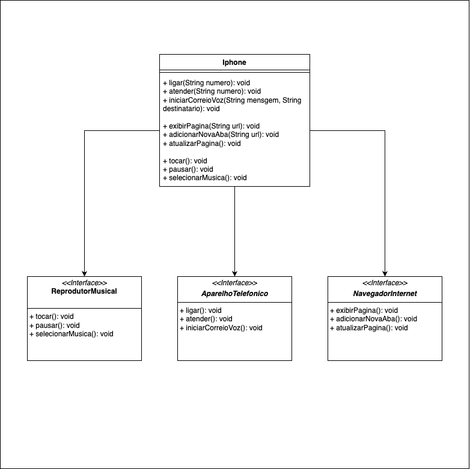

# 📱 Projeto de Diagramação de Classes do iPhone

## 📋 Sobre

Este repositório contém um projeto que modela as funcionalidades de um iPhone, abordando três aspectos principais: Reprodutor Musical, Aparelho Telefônico e Navegador na Internet. Utilizando conceitos de programação orientada a objetos e modelagem UML, foi criada uma estrutura detalhada e funcional.

## 📊 Diagrama UML

  

## Funcionalidades

- **Reprodutor Musical**
  - Métodos: `tocar()`, `pausar()`, `selecionarMusica(String musica)`
- **Aparelho Telefônico**
  - Métodos: `ligar(String numero)`, `atender()`, `iniciarCorreioVoz()`
- **Navegador na Internet**
  - Métodos: `exibirPagina(String url)`, `adicionarNovaAba()`, `atualizarPagina()`

## Conteúdo do Repositório

- **Código-fonte em Java**: Implementação das classes e interfaces.
- **Documentação Completa**: Detalhamento do design e da arquitetura do projeto.
- **Instruções de Execução**: Passo a passo para compilar e executar o código.
- **Diagrama UML**: Representação visual das classes e interfaces.

## Aprendizados

Durante este projeto, aprendi e apliquei técnicas avançadas de modelagem e programação orientada a objetos. Este desafio me proporcionou uma compreensão aprofundada sobre como projetar e implementar sistemas complexos de forma eficiente.
